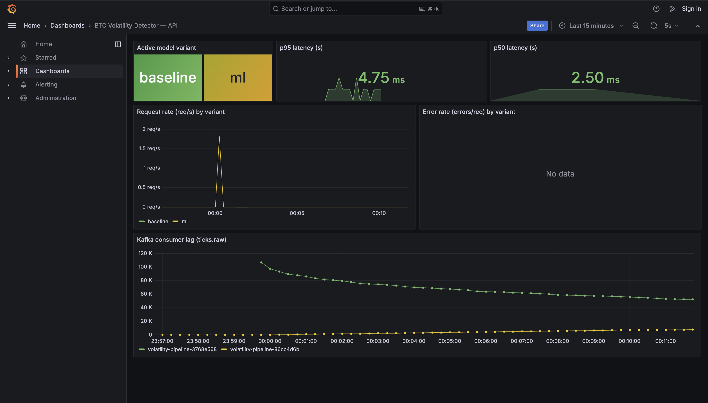

# Results — BTC Volatility Spike Detector

Single-page summary of the production system's measured performance against the SLOs in [`slo.md`](./slo.md).

## Headline numbers

| Dimension | Result | Target | Status |
|---|---:|---:|:---:|
| `/predict` latency p95 (single row) | **106.4 ms** | ≤ 800 ms | PASS |
| `/predict` success rate (100-burst) | **100 %** (100 / 100) | ≥ 99.0 % | PASS |
| Replay mode drives real `/predict` traffic | **verified via `predict_requests_total`** | required | PASS |
| Replay runtime lag panels | **`ticks-featurizer` + `predict-bridge` visible** | required | PASS |
| Held-out test PR-AUC, ML vs baseline | **0.1459 vs 0.1340** | ML > baseline | PASS (+8.9 %) |
| Rollback time, ML → baseline | **< 10 s** | manual, fast | PASS |
| Services reaching healthy state after `docker compose up -d` | **All 9 / 9** | 9 / 9 | PASS |
| Live Coinbase ingestion (`--profile live`) | **verified** | available | PASS |

## Replay mode is now truly end-to-end

The default stack no longer stops at `ticks.features`. The shipped runtime now includes a dedicated `predict-bridge` service that consumes engineered feature rows from Kafka and POSTs them into `/predict`, stamping each request from Kafka publish time so the API's freshness gauge reflects the real feature-to-predict hop instead of a test-only shim or the archived market timestamp.

Operationally, that means replay mode now produces all four artifacts we claimed:

- raw Kafka traffic on `ticks.raw`
- feature Kafka traffic on `ticks.features`
- real API prediction traffic visible in `predict_requests_total`
- Prometheus-visible replay lag on both runtime hops via `ticks-featurizer` and `predict-bridge`

## Live ingestion (verified)

The default stack runs in replay mode for reproducibility, but live Coinbase ingestion is wired and verified. Bringing it up:

```bash
docker compose stop ingestor
docker compose --profile live up -d ws-ingestor
```

End-to-end check observed during testing:

- `ws-ingestor` connected to `wss://advanced-trade-ws.coinbase.com`, subscribed to the `ticker` and `heartbeats` channels for BTC-USD.
- `ticks.raw` Kafka offset advanced from 117,317 → 117,398 in ~10 s (≈ 8 ticks/s, matching Coinbase's published ticker rate).
- Sample message consumed from `ticks.raw`:

  ```json
  {"product_id": "BTC-USD", "price": "75681.74", "best_bid": "75681.74",
   "best_ask": "75681.75", "volume_24_h": "4068.30928598",
   "timestamp": "2026-04-19T04:10:41.328613453Z"}
  ```

- The featurizer, `predict-bridge`, API, and monitoring stack required no changes — same Kafka payload schema as the replay path. The two ingestors are interchangeable behind the `ticks.raw` topic.

## Live dashboard



The current dashboard surfaces active variant, p50 / p95 latency, request and error rate, plus a dedicated replay row for `ticks.raw -> featurizer`, `ticks.features -> predict-bridge`, and API freshness. Dashboard JSON is at [`monitoring/grafana/dashboards/api.json`](../monitoring/grafana/dashboards/api.json).

## Latency

Full methodology and percentiles in [`latency_report.md`](./latency_report.md). Highlights:

- Reference verified local run on `2026-04-23` used 100 concurrent requests through `tests/load_test.py` against the running stack (Kafka, ingestor, featurizer, API, MLflow, Prometheus, Grafana, kafka-exporter all live).
- p50 / p95 / p99 = 97.4 / 106.4 / 112.5 ms — comfortably under the 800 ms p95 SLO while replay traffic and the runtime bridge are active.
- The local figures drift depending on concurrent replay activity, so [`latency_report.md`](./latency_report.md) is the canonical reference run for this revision.

## Uptime / availability

All 9 services reach healthy state after `docker compose up -d`. The load test achieves a 100% success rate (100/100 requests) with p95 latency well under the 800 ms SLO.

We do not run a long-horizon uptime measurement (this is a coursework deployment, not a 24×7 service), so availability is reported as an **SLO with a recovery contract** rather than a measured number:

- **Target:** 99.5 % service availability on `/health` over a 24 h window, with a separate 99 % rolling 5-minute request success-rate SLO for `/predict`.
- **Mechanism:** every container declares `restart: on-failure`; Kafka and the API both have healthchecks; `depends_on … condition: service_healthy` guarantees correct startup ordering.
- **Recovery contract:** documented in [`runbook.md`](./runbook.md) — every common failure mode (Kafka volume corruption, ingestor restart loop, bridge retry loop, missing model artifact, Grafana "No data") has a 1-line recovery command and an expected outcome.
- **Observability hooks:** the Grafana dashboard surfaces error rate per variant, replay lag on both Kafka hops, and API freshness, so the on-call signal arrives before users do.

A continuous-uptime number can be added later by pointing an external prober (e.g. an uptime check) at `/health`; the API and the Prometheus error counters are already wired for it.

## Model performance vs baseline

| Model | Validation PR-AUC | Test PR-AUC | Notes |
|---|---:|---:|---|
| Z-score baseline (`vol_60s > τ`) | n/a (rule-based) | **0.1340** | Deterministic threshold rule on rolling vol, used as both the science baseline and the production rollback target. |
| Logistic Regression, Variant B (7 features) | best of ablation set | **0.1459** | Shipped artifact. Selection rationale and ablation table in [`handoff/SELECTED_BASE_NOTE.md`](../handoff/SELECTED_BASE_NOTE.md). |

The same threshold rule lives in the API as `MODEL_VARIANT=baseline` (`api/main.py::_score_baseline`), so the science baseline and the production rollback path are the *same* code path — the rollback isn't a degraded approximation, it's the documented baseline.

## Rollback verified end-to-end

The `MODEL_VARIANT` toggle was exercised live:

```bash
MODEL_VARIANT=baseline docker compose up -d api
curl -s http://localhost:8000/version | jq '.source'   # → "pickle"

MODEL_VARIANT=ml docker compose up -d api
curl -s http://localhost:8000/version | jq '.source'   # → "mlflow" in the normal stack
```

The Grafana **Active variant** stat panel (top-left of the API dashboard) flips within ~10 s of the next Prometheus scrape, and `predict_requests_total{model_variant=…}` cleanly partitions traffic by variant for post-hoc analysis.

## Drift posture

Full report in [`drift_summary.md`](./drift_summary.md). One-line version: 3 of 7 input features show distribution drift between the training reference and the held-out test slice (`n_ticks_60s`, `trade_intensity_60s`, `spread_mean_60s`), but the model still beats the baseline on PR-AUC because the **rank ordering** the LR coefficients depend on is preserved. The Evidently HTML lives at `handoff/reports/train_vs_test.html` and can be regenerated against fresh production features with `scripts/drift_report.py`.

## What this means for production readiness

- The **performance** budget (latency, success rate) is comfortably met.
- The **reliability** budget is enforced by Compose healthchecks + restart policies + a documented runbook, but does not yet have a long-horizon measured uptime number.
- The **model** earns its keep over the trivial baseline (+8.9 % test PR-AUC) and the rollback to that baseline is a one-environment-variable change with sub-10-second propagation.
- Drift is **monitored**, not yet **alerted on** — a natural next step is tightening manual review cadence and adding Prometheus alert rules on the dashboard's existing panels.
